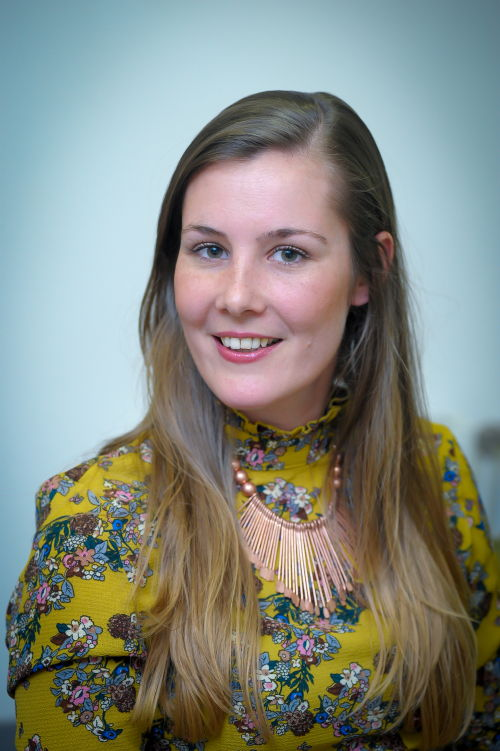

 
 
 

 

<b>Biography</b>

Dr Suzanne Aussems has been an Assistant Professor in Psychology at the University of Warwick since July 2020. She obtained BA (2007-2010) and MA degrees (2010-2012) in Culture Studies from Tilburg University, as well as a joint MPhil degree in Language and Communication (2012-2014) from Tilburg University and Radboud University Nijmegen, in the Netherlands. She obtained a PhD degree in Psychology from the University of Warwick (2014-2017), in the United Kingdom. After completing her PhD, she held two postdoctoral fellowships at the University of Warwick (2017-2019) and worked as postdoctoral researcher in developmental psychology at Royal Holloway University of London (2019-2020). 
 
 

<b>Contact</b>

<b>Dr Suzanne Aussems</b>
 
Assistant Professor
 
Department of Psychology
 
University of Warwick
<!-- 
Room H1.XX
 
Drop-in Mondays 1-2pm
 
&#9742; +44 (0)24 765X XXXX-->
 
&#9993; s.aussems.1@warwick.ac.uk

